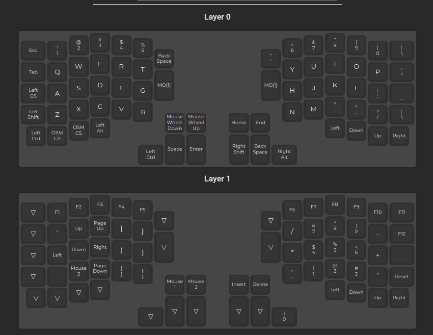

This is my setup for the Redox rev1 keyboard. It is based on a QWERTY layout for its plug-and-play capability and uses two software layouts that I change as needed.
There are extra contents:
- A .json file that can be uploaded to QMK Configurator. 
- A .zip file with an installer for colemak UK.
- A .sh script that can be used to run the script in case the default build environments are not set. It fetches the new keymap in the Downloads folder.

# Where to clone
Clone in .../qmk_firmware/keyboards/redox/keymaps

# Commands:
```
cd "your/path/to/keymaps"
qmk json2c goosoe.json -o keymap.c
qmk flash
```


# Software layout:
- UK extended (available in Windows and Linux)
- Colemak UK (https://colemak.com/File:Cmkuk.zip)

# Physical layout:


